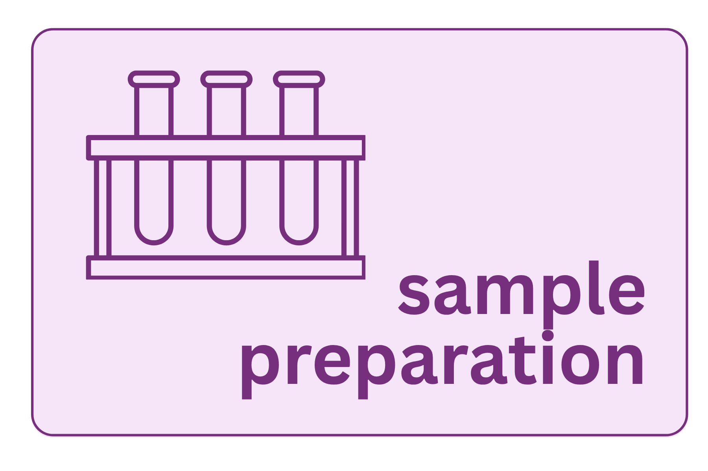

{fig-align="center" width="60%"}

16S rRNA gene sequencing is a culture-independent method, meaning you are characterizing an entire microbial community directly from a biological sample without growing anything in a lab. This power comes with a fundamental constraint: every organism present must yield its DNA through the same extraction protocol, regardless of how different its cell wall or membrane structure may be. The choices made before a single read is sequenced such as how the sample was collected, stored, lysed, and quantified will determine what biology you can detect and how much technical noise will propagate through every step that follows (Weinroth et al., 2022).

::: callout-warning
## Mitigating batch effects

Every decision in sample preparation introduces technical variation: extraction kit, bead-beating duration, storage conditions, PCR cycle number, who runs the extraction and when it is run. When that variation is **systematic** (e.g., all your cases were extracted in one batch and all your controls in another), it becomes a batch effect that is now indistinguishable from biology.

Here, you can see visualization of what a set of samples run in two batches look like when the researcher does and does not confound the treatment group with batch.

```{ojs}
//| echo: false
viewof design = Inputs.radio(["Confounded", "Balanced"], {
  value: "Confounded",
  label: html`<div style="font-size: 24px; font-weight: bold; text-align: center;">
    Study design
  </div>`
})
```

```{ojs}
//| echo: false
{
  function makeRng(seed) {
    let s = seed >>> 0;
    return () => { s = (Math.imul(s, 1664525) + 1013904223) >>> 0; return s / 4294967296; };
  }
  function randn(rng) {
    return Math.sqrt(-2 * Math.log(rng() + 1e-10)) * Math.cos(2 * Math.PI * rng());
  }

  const rng   = makeRng(7);
  const noise = Array.from({length: 40}, () => ({ nx: randn(rng), ny: randn(rng) }));

  const samples = noise.map((n, i) => {
    const batch = i < 20 ? "Batch 1" : "Batch 2";
    const group = design === "Confounded"
      ? (batch === "Batch 1" ? "Case" : "Control")
      : (i % 4 < 2 ? "Case" : "Control");
    const yOffset = design === "Balanced"
      ? (group === "Case" ? 1.1 : -1.1)
      : 0;
    return {
      batch, group,
      x: (batch === "Batch 1" ? -2.5 : 2.5) + n.nx * 1.2,
      y: yOffset + n.ny * 1.2
    };
  });

  const plotW = Math.floor((Math.min(width, 720) - 56) / 2);
  const yDomain = [-5, 5];

  function makePlot(field, domain, range) {
    return Plot.plot({
      width: plotW,
      height: 300,
      x: { label: "PC1", grid: true, tickFormat: d => d.toFixed(1) },
      y: { label: "PC2", grid: true, domain: yDomain, tickFormat: d => d.toFixed(1) },
      color: { domain, range, legend: true },
      marks: [
        Plot.dot(samples, {
          x: "x", y: "y", fill: field,
          r: 6, stroke: "white", strokeWidth: 1.5,
          title: d => `${d.group} — ${d.batch}`
        })
      ]
    });
  }

  function labeled(plot, titleText) {
    const wrap = Object.assign(document.createElement("div"), {
      style: "display:flex; flex-direction:column; align-items:center; flex:1; min-width:180px;"
    });
    const h = Object.assign(document.createElement("div"), {
      textContent: titleText,
      style: "font-weight:600; font-size:0.95rem; text-align:center; margin-bottom:0.35rem; color:#2a1a2e;"
    });
    wrap.append(h, plot);
    return wrap;
  }

  const caption = design === "Confounded"
    ? "Confounded design: cases and controls occupy separate batches. The two plots are mirror images — you cannot tell whether separation on any axis reflects biology or batch processing."
    : "Balanced design: batch drives the left/right separation on PC1. Within each batch, cases sit higher and controls lower — the case/control difference on PC2 is only detectable here because both groups appear in every batch.";

  const left  = labeled(makePlot("batch", ["Batch 1", "Batch 2"], ["#1565C0", "#C62828"]), "Batch");
  const right = labeled(makePlot("group", ["Case", "Control"],    ["#752f7d", "#2E7D32"]), "Treatment Group");

  const capEl = Object.assign(document.createElement("p"), {
    textContent: caption,
    style: "width:100%; margin:0.6rem 0 0; font-size:0.875rem; color:#555; font-style:italic;"
  });

  const container = Object.assign(document.createElement("div"), {
    style: `
      display: flex; flex-wrap: wrap; gap: 1rem; align-items: flex-start;
      border: 1.5px solid #d4b8d8; border-radius: 8px; padding: 1.25rem;
    `
  });
  container.append(left, right, capEl);
  return container;
}
```
:::

## A (not comprehensive list) of potential variation

### Extraction kit

Unlike single-species extractions, you are not targeting one known organism with a known lysis protocol. You are asking one protocol to work across all players all present in the same tube. No extraction kit is equally efficient for all of these, which means your results will always reflect, in part, which organisms your protocol lyses most efficiently.

This is not a flaw to be eliminated, just it is a reality to be understood. If every sample in your study is extracted the same way, the bias is systematic and consistent. If extraction method varies across samples or groups, the bias becomes a confounder.

### Cell lysis

The lysis step determines which organisms actually contribute DNA to your extract. Two broad strategies are used:

**Mechanical lysis (bead beating)** uses high-speed agitation with small beads to physically shear cell walls. It is the most effective approach for difficult-to-lyse organisms — gram-positive bacteria, fungi, spore-formers, and organisms with thick or unusual cell walls. The tradeoff is potential DNA shearing at high bead-beating intensities and co-extraction of more PCR inhibitors from the sample matrix.

**Chemical and enzymatic lysis** uses detergents, chaotropic salts, and enzymes (e.g., lysozyme, proteinase K) to dissolve membranes and digest cell walls. It is gentler and better suited to fragile organisms or samples where DNA integrity is a priority. It reliably lyses gram-negative bacteria but tends to underrepresent gram-positive taxa.

::: callout-note
## Consistent kit choice

Commercial kits vary in their lysis chemistry, bead type and size, binding conditions, and inhibitor removal capacity. Switching kits between samples or batches introduces a systematic bias. The same kit should be used from beginning to end of a study to mitigate unwanted variation.
:::

### Sample collection and storage

The time between sample collection and preservation is itself a biological variable. Microbial communities in biological samples begin changing immediately after collection — cells die, others proliferate, metabolic activity continues. Weinroth et al. (2022) note that the interval from collection to freezing can significantly alter 16S sequencing results. Best practices:

-   **Snap-freeze in liquid nitrogen and store at −80°C** — gold standard for most sample types
-   **DNA stabilization buffers** (RNAlater, OMNIgene·GUT) preserve community composition at room temperature for days to weeks when immediate freezing is not possible; validate for your specific matrix before relying on them
-   **Repeated freeze-thaw cycles** degrade DNA quality and alter community profiles — aliquot samples before freezing so each tube is used only once

::: callout-important
## Storage conditions are a biological variable

Samples stored at −80°C, −20°C, and room temperature will yield measurably different community profiles. Within a study, storage conditions must be identical across all samples. If some samples were handled differently — stored longer, frozen slower, thawed repeatedly — that difference must be documented and treated as a potential covariate in analysis.
:::

## Controls

Controls are not optional — they are the mechanism by which you distinguish biology from contamination and verify that your protocol is working.

**Negative extraction controls** (reagents only, no sample) should be run with every extraction batch. If sequences appear in your negative control after sequencing, you have contamination somewhere in your workflow — the kit reagents, the water, the bench surface, or the tubes. This is especially critical for low-biomass samples, where kit contaminants can represent a substantial fraction of the detected signal. This background contamination is sometimes called the **"kitome."**

**PCR negative controls** (water instead of template) catch contamination introduced during the amplification step, separate from extraction.

**Positive controls** (a mock community of known composition, such as the ZymoBIOMICS Microbial Community Standard) let you verify that your extraction and amplification are performing consistently across batches and that your downstream pipeline correctly identifies known taxa at expected proportions.

## Common failure modes

**Inhibitor carryover** — humic acids (soil, stool), heme (blood, tissue), polysaccharides (plant material), and bile salts can co-purify with DNA and inhibit PCR. Signs: poor or absent amplification despite adequate Qubit concentration. Additional clean-up steps (PowerClean Pro, 1:10 dilution series) can help identify and address inhibition.

**Low-biomass samples** — skin swabs, bronchoalveolar lavage, and many environmental samples contain so little microbial DNA that kit and reagent contamination becomes a meaningful fraction of the detected signal. Standard extraction volumes and protocols designed for high-biomass gut samples may not be appropriate. Negative controls become especially important.

**Host DNA dominance** — biopsies and mucosal samples may consist overwhelmingly of host (human or animal) DNA. The 16S primers are bacteria- and archaea-specific and will not amplify host sequences directly, but host DNA can compete for binding on silica columns and reduce microbial DNA yield during extraction.

**Inconsistent technique** — variation in homogenization thoroughness, bead-beating duration, or elution volume between operators or batches introduces technical noise that downstream statistics will interpret as biological signal. Written SOPs and training runs with reference samples reduce this source of error.