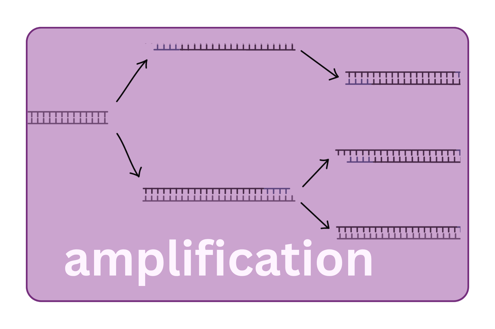

{fig-align="center" width="60%"}

16S rRNA amplicon sequencing works by selectively amplifying a conserved portion or portions of the 16S rRNA gene a gene present in virtually all bacteria and archaea, with conserved regions flanking hypervariable regions where the sequence differs enough to distinguish taxa.

## The 16S rRNA gene structure

The 16S rRNA gene is approximately 1,500 bp long and contains alternating conserved regions and nine hypervariable regions (V1–V9) whose sequence diversity distinguishes taxa — functioning like genetic barcodes. No single variable region resolves all taxa equally well, and short-read sequencing (150–300 bp per read) means you are targeting one or two regions at a time.

Your choice of target region is a consequential decision in your study design.

## Variable region selection

| Region | Forward / Reverse Primers | Amplicon Size | Sequencing Mode | Notes |
|---------------|---------------|---------------|---------------|---------------|
| V4 | 515F `GTGYCAGCMGCCGCGGTAA` / 806R `GGACTACHVGGGTWTCTAAT` | \~250 bp | 2×150 or 2×250 bp | Earth Microbiome Project standard; short, fits Illumina read lengths well; broad coverage |
| V3–V4 | 341F `CCTACGGGNGGCWGCAG` / 805R `GACTACHVGGGTATCTAATCC` | \~460 bp | 2×250 or 2×300 bp | Most common in clinical microbiome studies; better taxonomic resolution; requires good paired-end overlap |
| V4–V5 | 515F `GTGYCAGCMGCCGCGGTAA` / 926R `CCGYCAATTYMTTTRAGTTT` | \~380–415 bp | 2×250 bp | Better archaeal coverage |
| V1–V2 | 27F `AGAGTTTGATCMTGGCTCAG` / 338R `TGCTGCCTCCCGTAGGAGT` | \~310 bp | 2×250 bp | Better gram-positive resolution; less reference data |

::: callout-important
## Mixing samples with different primers: I wouldn't!

Community composition estimates are not directly comparable across studies that used different primer pairs. Even within the same region, primer mismatches can create systematic biases toward certain taxa. If you are comparing to published data or a reference cohort, you are best off using the same primer pair.
:::

## Primer design

Universal primers target the conserved region sequences. "Universal" is a relative term — primers vary in how well they match across the full breadth of bacterial diversity. Some lineages (e.g., *Verrucomicrobia*, *Tenericutes*, Archaea) can be systematically underamplified by common primer sets.

Primers for Illumina sequencing are ordered with adapter sequences attached so the amplicon can be directly sequenced without additional ligation. Some protocols use a two-step PCR: first to amplify the target, second to add the full sequencing adapters and barcodes.

## PCR conditions

**Number of cycles** — more cycles means more product from low-biomass samples, but also more chimera formation and amplification of contaminants. Most protocols use 25–35 cycles. For low-biomass samples, fewer cycles with higher input is preferable to more cycles.

**Annealing temperature** — lower temperatures allow more primer-template mismatches (broader coverage, more off-target). Higher temperatures are more specific. Most 16S protocols are validated at 50–55°C.

**Polymerase** — use a high-fidelity polymerase with low error rate. Taq is inexpensive but introduces errors and lacks proofreading; Phusion, Q5, or KAPA HiFi are better choices for amplicon work.

## What can go wrong

**Chimera formation** — during PCR, a partially-extended strand can anneal to a different template and be extended, creating a hybrid sequence that doesn't exist in nature. Chimeras are filtered computationally downstream, but they are introduced here. Minimizing cycle number and using high-fidelity polymerase reduces chimera rate.

**Primer dimers** — primers annealing to each other instead of template. Produces a small product (\~60–80 bp) that can dominate the library. Usually resolved with a bead cleanup after PCR.

**Differential amplification efficiency** — some taxa amplify more efficiently than others under your conditions. This introduces a systematic bias in relative abundance estimates that is inherent to amplicon sequencing and cannot be fully corrected.

## PCR duplicates and the relative abundance problem

Because PCR is exponential, relative abundance in the final library does not equal relative abundance in the original sample. A taxon at 1% true abundance might represent 1% or 3% or 0.3% in your sequence data depending on how efficiently it amplified. This is why 16S results are *relative* abundances, not absolute counts — and why absolute quantification requires additional approaches (e.g., spike-in standards, qPCR).

<details>

<summary>Example: what a library prep protocol sheet looks like</summary>

```         
Step 1: PCR amplification
  - Template: 10 ng extracted DNA
  - Primers: 515F / 806R with Nextera adapters
  - Polymerase: KAPA HiFi HotStart
  - Cycling: 95°C 3 min; [95°C 30s, 55°C 30s, 72°C 30s] x 25 cycles; 72°C 5 min

Step 2: Bead cleanup (0.8x AMPure XP)

Step 3: Index PCR (adds sample barcodes)
  - 8 cycles

Step 4: Bead cleanup (0.8x AMPure XP)

Step 5: Quantify (Qubit), check size (TapeStation, expected ~450 bp)

Step 6: Normalize and pool
```

</details>