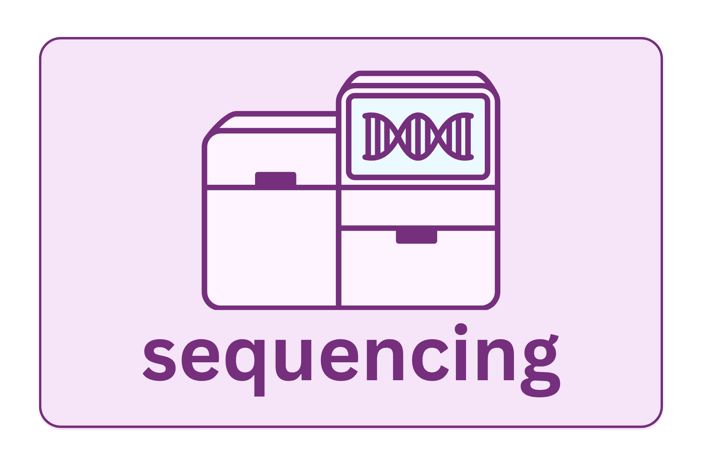

{fig-align="center" width="60%"}

The amplicon library is loaded onto a sequencer, which reads the nucleotide sequence of millions of DNA fragments simultaneously. For 16S rRNA studies, Illumina short-read sequencing on MiSeq or NovaSeq is standard. The sequencer produces a FASTQ file per sample (or per run, if not yet demultiplexed).

## How samples become reads

Understanding the flow from plate to data file makes many downstream analytical decisions easier to interpret:

1.  **Extraction and amplification** — DNA is extracted from each sample and the 16S region is amplified with barcoded primers. Each sample gets a unique barcode, so its reads can later be identified.
2.  **Pooling** — Amplified libraries from all samples are combined into a single tube and loaded onto the sequencer together. All samples share the same flow cell.
3.  **Sequencing** — The machine randomly samples from the mixed pool. It does not allocate reads equally across samples; it samples stochastically from whatever DNA is present.
4.  **Demultiplexing output** — After sequencing, reads are sorted back to individual samples using their barcodes, producing one FASTQ file (or file pair) per sample.

The stochastic nature of step 3 is why read counts vary across samples even when pooling was careful: differences in pipetting accuracy, PCR efficiency, DNA quality, and random cluster formation all contribute. This technical variation in sequencing depth is the reason normalization is required before comparing diversity across samples.

::: callout-warning
## Always remember the pooling!

During 16S rRNA library preparation, samples are pooled into a single sequencing library while maintaining identity through barcoding. However, because libraries are not always perfectly normalized before pooling, this can result in uneven sequencing depth across samples, which may affect downstream diversity estimates and the detection of low-abundance taxa.
:::

## Single-end vs. paired-end sequencing

Illumina instruments can read each DNA fragment from one end only (**single-end**) or from both ends (**paired-end**), producing a forward read (R1) and a reverse read (R2). For paired-end runs, if the read length is sufficient, R1 and R2 overlap in the middle of the amplicon. This overlapping region is used to error-correct both reads. Disagreements in the overlap are resolved using quality scores, and this substantially improves accuracy.

-   **Single-end** may be sufficient for short amplicons like V4 (\~250 bp) with 2×150 bp reads, though paired-end is still preferred.
-   **Paired-end** is required for longer amplicons like V3–V4 (\~460 bp), where overlap is essential for merging and error correction.

::: callout-note
## Paired-end sequencing

As it is generally the standard, the rest of this workshop will focus on paired-end data. However, the tools referenced in the coding examples can be adjusted with general ease to run on single-end data as required.
:::

## Platform choices

**MiSeq** is the most common platform for 16S work. It supports longer reads (2×250 bp or 2×300 bp paired-end) and has a well-established track record for amplicon sequencing. Throughput is lower (\~25M reads/run) and cost-per-run is higher than HiSeq/NovaSeq, but the read quality and length are well-suited to 16S amplicons (\~450 bp for V3–V4).

**NovaSeq** produces vastly more reads but with shorter read lengths (2×150 bp standard). This is sufficient for V4-only studies and is increasingly used when large sample numbers or high depth are needed, but may not provide full overlap for longer amplicons.

## Sequencing depth

How many reads do you need per sample? There is no universal answer, but some common guidelines are listed here:

-   For gut microbiome (high biomass, high diversity): 10,000–50,000 reads/sample is common
-   For low-diversity samples (vaginal, skin): fewer reads may be sufficient
-   For low-biomass samples: deeper sequencing helps, but also amplifies contamination signal

We can see below the impact of the level of diversity in a sample and how deep we need to sequence it in the example below.

### What a rarefaction curve looks like

Drag the slider below to change sequencing depth and watch how each sample's curve responds. A flattened curve means diversity is captured; a still-rising curve means additional reads would continue to reveal new taxa.

```{ojs}
//| echo: false
viewof seqDepth = Inputs.range([2000, 80000], {
  value: 30000,
  step: 500,
  label: "Sequencing depth (reads per sample)"
})
```

```{ojs}
//| echo: false
{
  function curve(richness, halfSat, group) {
    return Array.from({length: 101}, (_, i) => {
      const r = (i / 100) * seqDepth;
      return { reads: r, asv: richness * r / (halfSat + r), group };
    });
  }

  const samples = [
    { richness: 200, halfSat: 3000,  label: "Sample A — moderate diversity (ex. gut)"           },
    { richness:  80, halfSat: 2000,  label: "Sample B — low diversity (ex. skin)"             },
    { richness: 500, halfSat: 80000, label: "Sample C — high diversity (ex. environmental)" }
  ];

  const data = samples.flatMap(s => curve(s.richness, s.halfSat, s.label));

  const endpoints = samples.map(s => {
    const asv = s.richness * seqDepth / (s.halfSat + seqDepth);
    const pct  = asv / s.richness * 100;
    return { reads: seqDepth, asv, pct, plateaued: pct >= 90, label: s.label };
  });

  const w = Math.min(width, 720);

  return Plot.plot({
    width: w,
    height: 380,
    marginRight: 205,
    x: {
      label: "Reads per sample →",
      tickFormat: d => `${(d / 1000).toFixed(0)}k`,
      grid: true
    },
    y: {
      label: "↑ Observed ASVs",
      domain: [0, 520],
      grid: true
    },
    color: {
      legend: true,
      domain: samples.map(s => s.label),
      range: ["#1565C0", "#2E7D32", "#C62828"]
    },
    marks: [
      Plot.line(data, {
        x: "reads", y: "asv", stroke: "group", strokeWidth: 2.5
      }),
      Plot.dot(endpoints, {
        x: "reads", y: "asv", fill: "label", r: 7,
        stroke: "white", strokeWidth: 1.5
      }),
      Plot.text(endpoints, {
        x: "reads", y: "asv",
        text: d => `${d.plateaued ? "✓" : "⚠"} ${d.pct.toFixed(0)}% captured`,
        dx: 12,
        fontSize: 12,
        fill: d => d.plateaued ? "#2E7D32" : "#C62828",
        fontWeight: "bold",
        textAnchor: "start",
        lineAnchor: "middle"
      })
    ]
  });
}
```

::: callout-tip
## What to look for

-   **Plateau reached (✓)** — the curve has flattened. Additional reads would yield few new taxa; sequencing depth is adequate.
-   **Still rising (⚠)** — the curve has not flattened. Rare taxa are being missed and diversity estimates will be biased downward.

Notice that the environmental sample (Sample C) requires far more reads to plateau than the gut or vaginal samples. Different sample types have very different depth requirements. This is why "10,000 reads" is not a universal standard.
:::

## What the sequencing core delivers

You will typically receive:

-   One FASTQ file per sample per read direction (R1 and R2), or a single multiplexed FASTQ with all samples combined

-   A sample sheet mapping barcodes to sample IDs

-   A run report with quality metrics (% clusters passing filter, Q30 score)

Inspect the run report before beginning analysis. A run with \<75% clusters passing filter or Q30 \<70% warrants a conversation with the core facility.