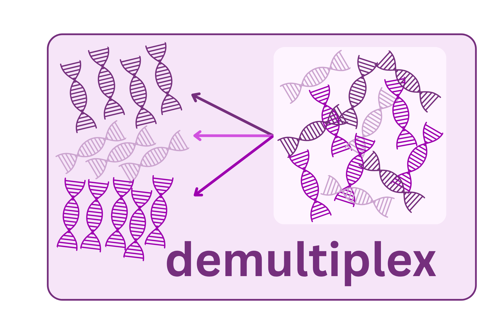

{fig-align="center" width="60%"}

When multiple samples are sequenced together on a single run (which is almost always the case — it would be prohibitively expensive to run one sample per sequencer lane), the reads from all samples are mixed together in the raw output. Demultiplexing is the process of sorting those reads back to the correct sample using the unique barcode or index sequence attached to each sample's library.

## What you receive from the core: multiplexed vs. demultiplexed

Sequencing data from a core facility or commercial provider arrives in one of two states:

-   **Demultiplexed** — one FASTQ file pair per sample (e.g., `Sample1_R1.fastq.gz`, `Sample1_R2.fastq.gz`). Sample identifiers are in the filenames. This is what most modern Illumina runs deliver. No demultiplexing step is needed, but you still need to remove primer sequences.
-   **Multiplexed** — one or two large FASTQ files containing reads from all samples mixed together, plus a separate index file or barcode map. You must run demultiplexing yourself before any other analysis.

**How to tell which you have:** If you receive many files with recognizable sample names in the filenames, your data is already demultiplexed. If you receive one or two large files without sample identifiers, the data is still multiplexed. When in doubt, ask the core — starting with the wrong assumption will cause the first step of your analysis to fail silently.

If you need to demultiplex yourself, QIIME2's `demux` plugin handles the most common inline-barcode and dual-index formats.

## How samples are distinguished

During library prep, each sample's amplicons are tagged with a unique short sequence called a barcode or index. This may be:

-   **Inline barcodes** — embedded directly in the primer sequence, immediately adjacent to the primer
-   **Illumina dual indices** — short sequences added as separate adapter sequences, read by the instrument in separate index-read cycles

For most modern Illumina workflows, the instrument itself handles the initial demultiplexing using dual indices before you ever see the data. In that case, you receive pre-demultiplexed FASTQ files — one per sample. You still need to remove the primer sequences (which are not part of the biological read).

For older or custom protocols using inline barcodes, demultiplexing is a computational step you run yourself.

## Primer trimming

Regardless of the demultiplexing approach, the primer sequences themselves need to be removed before analysis. Primers are not part of the 16S sequence you want to analyze — they are artificial sequences that you added. If they are not removed, they will interfere with alignment to the reference database.

**Cutadapt** is the standard tool for primer trimming. It searches for the primer sequence at the start of each read and removes it, along with any adapter content that may appear at the read ends.

::: callout-warning
## Primer trimming is not optional

Leaving primers in reads is a common mistake. In DADA2, primers extend into the region used for error modeling and denoising. In QIIME2, untrimmed reads will fail or produce spurious ASVs. Always verify primers are removed by checking that the per-base sequence composition in FastQC no longer shows a conserved sequence at position 1.
:::

<details>

<summary>Example: Cutadapt primer trimming command</summary>

``` bash
# Trim 515F/806R primers from paired-end reads
cutadapt \
  -g GTGYCAGCMGCCGCGGTAA \   # forward primer
  -G GGACTACNVGGGTWTCTAAT \  # reverse primer (reverse complement)
  --discard-untrimmed \       # drop reads where primer was not found
  --minimum-length 100 \
  -o sample_R1_trimmed.fastq.gz \
  -p sample_R2_trimmed.fastq.gz \
  sample_R1.fastq.gz \
  sample_R2.fastq.gz
```

</details>

## Barcode mismatch tolerance

When demultiplexing using barcodes, you must decide how many mismatches to allow between the expected barcode and the observed sequence. A common setting is 0–1 mismatches.

-   **0 mismatches**: strict — fewer reads assigned, but lower rate of cross-contamination between samples
-   **1 mismatch**: recovers more reads from samples with sequencing errors in the barcode region, but increases the risk of assigning a read to the wrong sample

With modern dual-index schemes, this is less of a concern, but with inline barcodes it is an important parameter to document.

## Checking demultiplexing results

After demultiplexing, inspect:

-   **Read counts per sample** — are they roughly balanced? An outlier with dramatically fewer reads may have had poor library prep, a failed PCR, or a barcode collision.
-   **Unassigned reads** — what fraction of reads could not be assigned to any sample? Some unassigned reads are normal (reads from PhiX, primer dimers, index-hopping), but if \>20% are unassigned, something went wrong.

## What can go wrong

**Sample swaps** — if samples were loaded into the wrong wells during library prep, the barcodes will assign reads to the wrong samples. This is undetectable computationally without external metadata (e.g., knowing which samples should be similar). Always maintain a physical sample tracking record.

**Low read counts in specific samples** — often traces back to the wet lab (poor amplification, poor normalization in the pooling step). A sample with \<1,000 reads after demultiplexing may need to be excluded from analysis or re-run.

**Contamination from a dominant sample** — if one sample has vastly more reads than others in the pool (because it was overloaded during pooling), index hopping can bleed a small number of its reads into neighboring wells. This is usually visible as unexpected taxa at low abundance in your negative controls.