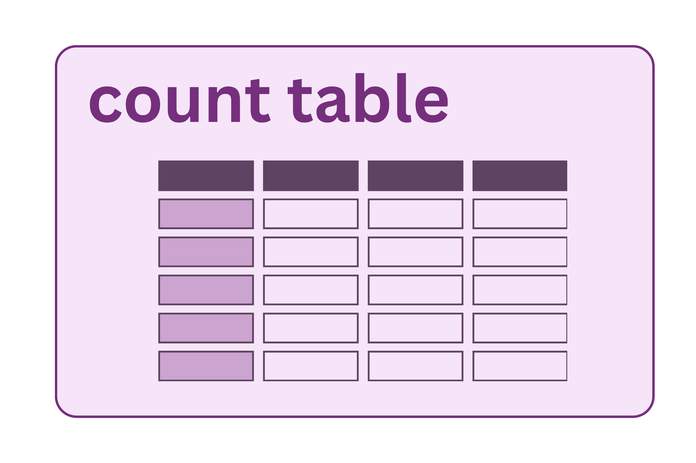

{fig-align="center" width="60%"}

The count table is the central data object in a microbiome study: a matrix of taxa (rows) × samples (columns), where each cell contains the number of sequencing reads assigned to that taxon in that sample. Every diversity analysis, differential abundance test, and visualization works from this table. The decisions made in building it affect everything that follows.

## ASVs vs. OTUs: a philosophical divide

There are two main approaches to going from reads to taxa.

### OTU clustering

Operational Taxonomic Units (OTUs) group similar sequences together based on a percent identity threshold, typically 97% (the conventional proxy for a bacterial "species"). All reads within 97% of each other are collapsed into a single OTU represented by a consensus or centroid sequence.

-   **Pro**: tolerant of sequencing errors (errors fall within the similarity threshold)
-   **Con**: different taxa can be merged into the same OTU; the 97% threshold is arbitrary and varies in its biological meaning across lineages; results change depending on clustering order; not reproducible across datasets with different sample sets

### ASV denoising (DADA2, Deblur)

Amplicon Sequence Variants (ASVs) are exact sequences — the actual nucleotide sequence of each unique variant, after sequencing errors have been corrected by a statistical model. Instead of clustering, DADA2 models the error process of the sequencing run and uses that model to distinguish true biological variants from noise.

-   **Pro**: exact sequences are reproducible across studies and databases; can resolve variants differing by a single base; exact sequences can be searched against any database
-   **Con**: requires a good error model (poor quality data = poor error model); computationally more intensive

::: callout-note
## The field has largely moved to ASVs

Most current publications and tools (DADA2, QIIME2's default, Deblur) use ASVs. If you are comparing to older literature or datasets that used OTU clustering, be aware that they are not directly comparable without re-analysis.
:::

## How DADA2 builds the count table

1.  **Learn error rates** — the algorithm examines quality score profiles across all reads in the run to build a model of how often each nucleotide is substituted for another at each quality score. This is why all samples in a run should be processed together during error learning.

2.  **Denoise** — reads are corrected based on the error model, and unique true sequences (ASVs) are identified.

3.  **Merge paired reads** — corrected R1 and R2 reads are aligned and merged in the overlap region. Non-overlapping pairs are discarded.

4.  **Remove chimeras** — sequences that appear to be PCR chimeras (composites of two real sequences) are identified and removed.

5.  **Assign taxonomy** — each ASV is compared against a reference database (Silva, Greengenes2, NCBI) to get a taxonomic classification.

<details>

<summary>Example: what the DADA2 output pipeline looks like</summary>

``` r
# Learn error rates (run once per sequencing run)
err_forward <- learnErrors(filtered_forward, multithread = TRUE)
err_reverse <- learnErrors(filtered_reverse, multithread = TRUE)

# Denoise
dada_forward <- dada(filtered_forward, err = err_forward, multithread = TRUE)
dada_reverse <- dada(filtered_reverse, err = err_reverse, multithread = TRUE)

# Merge
merged <- mergePairs(dada_forward, filtered_forward,
                     dada_reverse, filtered_reverse)

# Build count table
seqtab <- makeSequenceTable(merged)

# Remove chimeras
seqtab_nochim <- removeBimeraDenovo(seqtab, method = "consensus")

# Assign taxonomy (against Silva)
taxa <- assignTaxonomy(seqtab_nochim, "silva_nr_v138_train_set.fa.gz")
```

</details>

## Reference databases for taxonomy

The reference database you choose affects which taxa you can name and at what resolution.

| Database | Notes |
|------------------------------------|------------------------------------|
| **Silva** | Most comprehensive; updated regularly; used for bacteria, archaea, and some eukaryotes |
| **Greengenes2** | Updated 2022; improved integration with Earth Microbiome Project data |
| **NCBI RefSeq** | Broad coverage; useful for linking to NCBI records |
| **UNITE** | Fungi-specific; required if your primers target ITS instead of 16S |

Taxonomy assignment is probabilistic — confidence at the genus or species level is often low. Species-level calls from 16S are unreliable; genus is typically the deepest reliable level for most taxa.

## What can go wrong

**Poor error model** — if the run had poor quality or very low read counts, DADA2's error model will be poorly estimated. Signs: very few ASVs recovered, or implausibly large numbers of ASVs. Running with pooling (`pool = TRUE`) or pseudo-pooling can help for low-abundance samples.

**Merge failures** — if too few reads merge (check the `dada2` step summary), the truncation lengths are likely the culprit (see Quality Control). Some pipelines accept single-end reads as a fallback.

**Chimera over-removal** — the chimera removal step is aggressive. Rare legitimate ASVs can be incorrectly flagged as chimeras if they resemble combinations of two more abundant sequences. This is an inherent limitation and not fully controllable.

**Database gaps** — sequences from understudied environments or unusual taxa may get no classification below phylum or even domain level. "Unclassified" is a real biological result in many communities — don't discard it.

## Tracking read counts through the pipeline

Most pipelines produce a summary table of read counts at each step (input → filtered → denoised → merged → chimeras removed). This is essential for diagnosing where reads are being lost. A healthy pipeline looks like:

| Step                  | Reads        |
|-----------------------|--------------|
| Input                 | 50,000       |
| After filtering       | 42,000 (84%) |
| After denoising       | 41,500 (99%) |
| After merging         | 39,000 (94%) |
| After chimera removal | 38,000 (97%) |

Large drops at any single step indicate a problem at that stage.

## Taxonomic classification

Once ASVs are identified, each sequence is compared against a reference database of known 16S rRNA sequences to assign a taxonomic label. Bacterial taxonomy is a hierarchical system:

**Domain → Phylum → Class → Order → Family → Genus → Species**

For example: *Bacteria → Firmicutes → Bacilli → Lactobacillales → Lactobacillaceae → Lactobacillus → L. acidophilus*

QIIME2 classifies sequences using a trained **Naïve Bayes classifier** against a reference database (commonly SILVA or Greengenes2). The classifier compares each ASV to reference sequences and returns the deepest taxonomic level at which it can make a confident assignment, along with a probability score.

Key caveats: - **Species-level calls are unreliable.** The V4 region (\~250 bp) often lacks the resolution to distinguish closely related species. Genus is typically the deepest reliable level for most taxa. - **"Unclassified" is a real result.** ASVs that don't match any reference sequence may represent genuinely novel or understudied taxa. Do not discard them. - **Database choice matters.** SILVA, Greengenes2, and NCBI vary in their coverage and update frequency. Use the database that is most appropriate for your sample type and most current.

## Phylogenetic tree

Many key diversity metrics require a phylogenetic tree — a branching diagram representing evolutionary relationships among the ASVs in your dataset. Sequences that are more similar cluster closer together; more distantly related sequences branch farther apart. Branch lengths reflect evolutionary distance.

The tree is built in three steps: (1) ASV sequences are aligned so that comparable positions line up across taxa; (2) an evolutionary model estimates how different the sequences are; (3) the resulting distances are used to construct the branching diagram.

Why it matters:

-   **Faith's Phylogenetic Diversity (PD)** measures not just how many taxa are present but how much evolutionary branch length they collectively span. A community with 10 evolutionarily diverse bacteria scores higher than one with 10 closely related strains, even with the same ASV count.
-   **UniFrac distances** compare communities by asking how much of the evolutionary tree they share. Unweighted UniFrac uses presence/absence; weighted UniFrac incorporates abundances.

::: callout-note
## Why evolutionary context changes the picture

Counting species alone misses something important. A gut community containing both *Firmicutes* and *Bacteroidetes* spans far more evolutionary distance than one dominated by closely related *Lachnospiraceae*, even if both have the same number of ASVs. The phylogenetic tree is what makes that distinction visible in a diversity metric.
:::