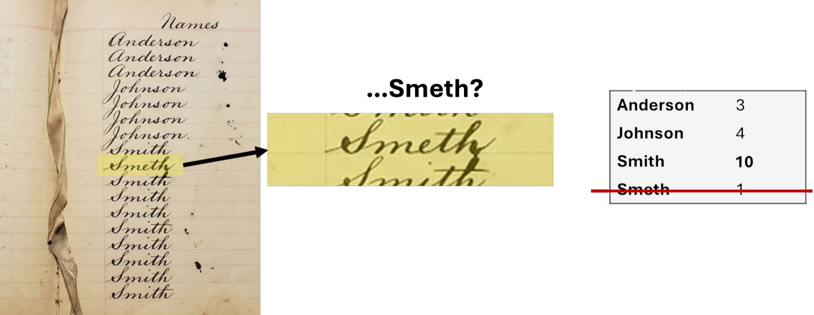

The count table is the central data object in a microbiome study: a matrix of features, often taxa (rows) × samples (columns), where each cell contains the number of sequencing reads assigned to that taxon in that sample. Every diversity analysis, differential abundance test, and visualization works from this table.

## ASVs vs. OTUs: a philosophical divide

There are two main approaches to going from reads to features. Operational Taxonomic Units are not often used in current analyses, but are worth reviewing to understand their impact in older studies.

::: {.callout-note .city-analogy}
## The census taker's notebook

Imagine a census taker going door to door through the microbial city, recording every resident's last name. Because they're writing quickly, some entries come out a little garbled. A resident named **Smith** might appear as **Smeth** in a handful of entries, because the dot over the *i* was lost in a hurried pen stroke. It is worth noting, however, that there is truly a **Smith** family and a **Smyth** family that are distinct in this city.

{fig-align="center" width="600"}

Now we can look at the methods to resolve this below.
:::

### OTU clustering

Operational Taxonomic Units (OTUs) group similar sequences together based on a percent identity threshold, typically 97% (the conventional proxy for a bacterial "species"). All reads within 97% of each other are collapsed into a single OTU represented by a consensus or centroid sequence.

-   **Pro**: tolerant of sequencing errors (errors fall within the similarity threshold)
-   **Con**: different taxa can be merged into the same OTU; the 97% threshold is arbitrary and varies in its biological meaning across lineages; results change depending on clustering order; not reproducible across datasets with different sample sets

::: {.callout-note .city-analogy}
## The census taker's notebook

**OTU clustering** is like a supervisor who reviews the notebook and says: *"Smeth and Smith are close enough. I'll put them in the same household."* Anyone within a similarity threshold gets merged into one group. This is forgiving of sloppy handwriting, but it can also lump genuinely different residents together, such **Smith** and **Smyth**, just because their names look alike. The threshold is arbitrary, and you can no longer tell if the Smiths and the Smyths and the Smeths are genuinely distinct families or a writing error.
:::

### ASV denoising

Amplicon Sequence Variants (ASVs) are exact sequences, the actual nucleotide sequence of each unique variant, after sequencing errors have been corrected by a statistical model. Instead of clustering, DADA2 models the error process of the sequencing run and uses that model to distinguish true biological variants from noise.

-   **Pro**: exact sequences are reproducible across studies and databases; can resolve variants differing by a single base; exact sequences can be searched against any database
-   **Con**: requires a good error model (poor quality data = poor error model); computationally more intensive

::: {.callout-note .city-analogy}
## The census taker's notebook

**ASV denoising** takes a different approach. Instead of grouping by similarity, it studies the *census taker's handwriting habits* across thousands of entries. It learns that this particular writer tends to skip *i* dots when rushing, and concludes that "Smeth" appearing a few times alongside a high-frequency "Smith" is almost certainly a transcription error and corrects it. But if someone truly named **Smeth** keeps showing up consistently at a rate that can't be explained by handwriting error alone, the algorithm keeps them as a real, distinct resident.

The result: ASVs give you exact, corrected sequences that are reproducible across studies. OTUs give you approximate groups that tolerate noise but sacrifice resolution.
:::

::: callout-caution
## The field has largely moved to ASVs

Most current publications and tools (DADA2, QIIME2's default, Deblur) use ASVs. If you are comparing to older literature or datasets that used OTU clustering, be aware that they are not directly comparable without re-analysis.

The coding examples here will focus on denoising for this reason.
:::

## How DADA2 builds the count table

1.  **Learn error rates**: the algorithm examines quality score profiles across all reads in the run to build a model of how often each nucleotide is substituted for another at each quality score. This is why all samples in a run should be processed together during error learning.

2.  **Denoise**: reads are corrected based on the error model, and unique true sequences (ASVs) are identified.

3.  **Merge paired reads**: corrected R1 and R2 reads are aligned and merged in the overlap region. Non-overlapping pairs are discarded.

4.  **Remove chimeras**: sequences that appear to be PCR chimeras (composites of two real sequences) are identified and removed.

Once these steps have completed, the unique sequences are officially considered amplicon sequencing variants (ASVs).

::: {.callout-tip collapse="true"}
## Code and tool examples

**DADA2**

For more information about DADA2, see the [original Nature Methods paper](https://www.nature.com/articles/nmeth.3869) and the [R package tutorial](https://benjjneb.github.io/dada2/tutorial.html).

``` r
# Learn error rates (run once per sequencing run)
err_forward <- learnErrors(filtered_forward, multithread = TRUE)
err_reverse <- learnErrors(filtered_reverse, multithread = TRUE)

# Denoise
dada_forward <- dada(filtered_forward, err = err_forward, multithread = TRUE)
dada_reverse <- dada(filtered_reverse, err = err_reverse, multithread = TRUE)

# Merge
merged <- mergePairs(dada_forward, filtered_forward,
                     dada_reverse, filtered_reverse)

# Build count table
seqtab <- makeSequenceTable(merged)

# Remove chimeras
seqtab_nochim <- removeBimeraDenovo(seqtab, method = "consensus")
```

**QIIME2**

For more information, see the [QIIME2 dada2 plugin documentation](https://docs.qiime2.org/2024.10/plugins/available/dada2/).

``` bash
qiime dada2 denoise-paired \
  --i-demultiplexed-seqs demux-paired-end.qza \
  --p-trim-left-f 0 \
  --p-trim-left-r 0 \
  --p-trunc-len-f 230 \
  --p-trunc-len-r 180 \
  --o-table table.qza \
  --o-representative-sequences rep-seqs.qza \
  --o-denoising-stats denoising-stats.qza
```
:::

## What the ASV table looks like

The output is a matrix where rows are ASVs (each identified by its exact nucleotide sequence or more commonly a short hash) and columns are samples. Each cell is an integer count.

| ASV     | Sample_1 | Sample_2 | Sample_3 | Sample_4 |
|---------|----------|----------|----------|----------|
| ASV_001 | 1284     | 0        | 532      | 891      |
| ASV_002 | 0        | 4471     | 213      | 0        |
| ASV_003 | 62       | 88       | 0        | 1104     |
| ASV_004 | 3100     | 2850     | 2901     | 3200     |
| …       | …        | …        | …        | …        |

This table will have thousands of rows (one per unique ASV) and one column per sample. Most cells will be zero, as ASVs are typically present in only a subset of samples.

::: callout-caution
## These counts are not directly comparable

The integers in this table are absolute, raw read counts. A count of 1,284 for ASV_001 in Sample_1 means nothing on its own without knowing how many total reads that sample produced.

Looking at the table above, Sample_1 has a total of 4,446 reads across these four ASVs, while Sample_2 has 7,409. If ASV_003 appears in Sample_1 at 62 reads and in Sample_2 at 88 reads, that does not mean it is more abundant in Sample_2. It may be that Sample_2 simply had more reads to begin with. Comparing raw counts is not possible without adjusting somehow for this difference in sequencing depth.

This is addressed in the upcoming [Normalization](normalization.qmd) section, which discuses some of the methods to account for these depth differences before any downstream analysis.
:::

## Tracking read counts through the pipeline

Most pipelines produce a summary table of read counts at each step (input → filtered → denoised → merged → chimeras removed). This is a good method for diagnosing where reads are being lost. This may look something like this table:

| Step                  | Reads        |
|-----------------------|--------------|
| Input                 | 50,000       |
| After filtering       | 42,000 (84%) |
| After denoising       | 41,500 (99%) |
| After merging         | 39,000 (94%) |
| After chimera removal | 38,000 (97%) |

Large drops at any single step indicate a problem at that stage.

::: {.callout-note collapse="true"}
## More resources on OTU and ASV methods

For more information and comparisons between methods, see the following resources:

-   [Comparison of six different methods, three OTU-based and three ASV-based on mock sample](https://journals.plos.org/plosone/article?id=10.1371/journal.pone.0227434)

-   [Consideration of the impact of OTU versus ASV methods when considering diversity metrics](https://journals.asm.org/doi/10.1128/msphere.00148-18)
:::