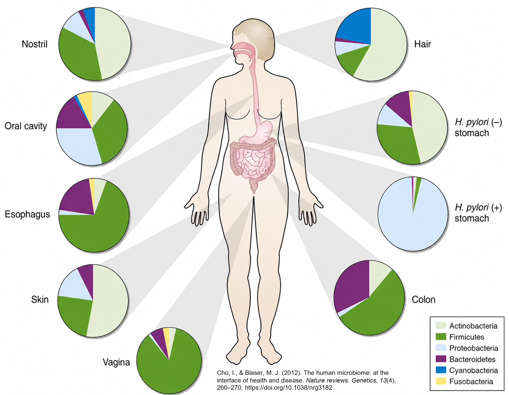
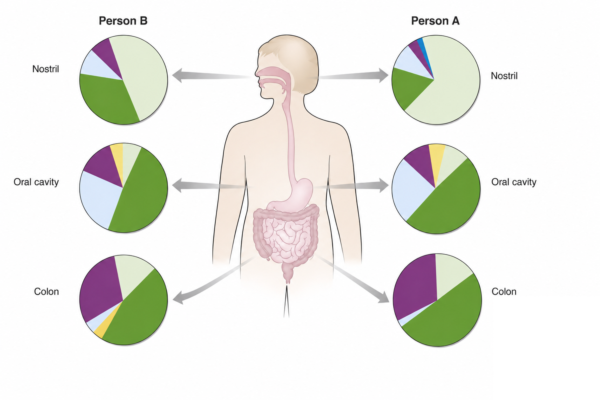
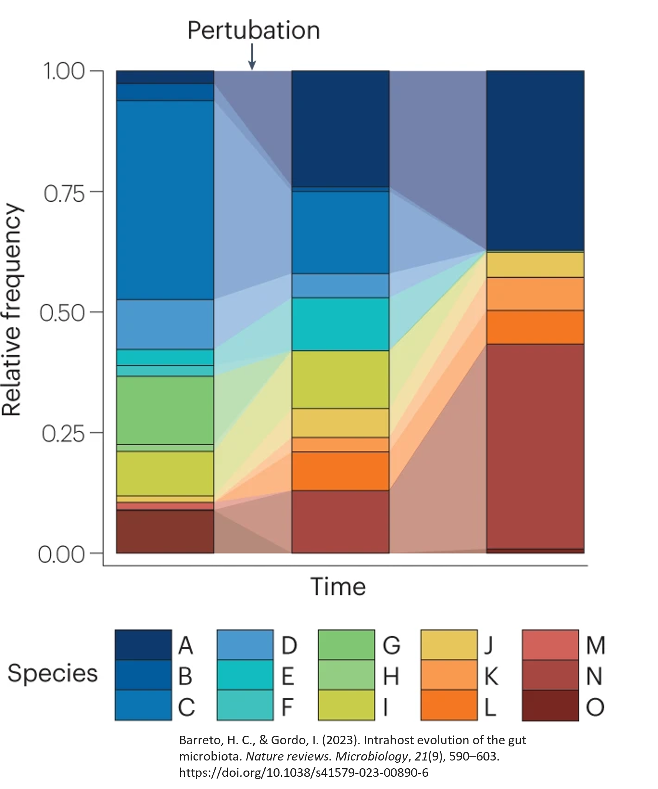
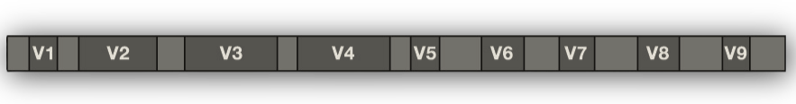

The human body is home to trillions of bacteria, archaea, viruses, and fungi that are collectively called the **microbiome**. These communities play roles in immune development, metabolism, and susceptibility to disease. Understanding which microbes are present, in what proportions, how they work together (or not), what they produce and consume, and how those communities differ across individuals or conditions is a common question in medical research.

## What is the microbiome?

The term **microbiome** refers to the complete collection of microorganisms inhabiting a particular environment. In humans, that environment can be the gut, skin, oral cavity, lung, vaginal tract, or any number of other niches. Each body site harbors a distinct community shaped by the local environment: temperature, pH, oxygen availability, and available nutrients.

The gut microbiome is the most studied. A healthy adult gut hosts hundreds to thousands of bacterial species, though these proportions are certainly not fixed and change within a person over time and from person to person.

## The microbial city

Just like the microbiome, a city is a community made up of people who live, work, and play in the same geographic location. They interact with each other in different units, like families or friends, and, just like people, they have different roles in their environment that make them distinct. This site uses this comparison to help make the different steps of microbiome analysis more intuitive.

::: {.callout-note .city-analogy}
## How to use the city analogy

Throughout this workshop, callouts like this one pair a city or census scenario with the concept being introduced on that page. The city's residents are its microbes; 16S sequencing is the census; the census takers are the reagents, instruments, and analysts — each with their own habits, biases, and occasionally sloppy handwriting. When you see this callout, you're getting the analogy version of what follows.
:::

## Variability in the microbiome

The human microbiome is variable in multiple ways, ranging from within the same person to across multiple people.

### **Within individuals**

When we consider two cities in the same state, one on a beach and one that is land-locked, we know that there are differences between them despite both being cities. For example, our beach city would more than likely have more surfers and life guards than our landlocked city would.

```{ojs}
//| echo: false
{
  const cities = {
    landlocked: {
      label: "Landlocked City",
      img: "assets/landlocked-city-1.png",
      color: "#1B3A58",
      bullets: [
        "Snowplow drivers and road crews are common in winter months",
        "Coprorate workers make up a large share of the workforce",
        "Stable year-round population with fewer seasonal visitors"
      ]
    },
    beach: {
      label: "Beach City",
      img: "assets/beach-city.png",
      color: "#1565C0",
      bullets: [
        "Lifeguards and surf instructors arrive every summer",
        "Tourism and hospitality workers spike seasonally",
        "Fishing and maritime industries are present year-round",
        "High turnover of seasonal residents and vacationers"
      ]
    }
  };

  const wrap = html`<div></div>`;

  const cards = html`<div style="display:flex; gap:1.5rem; justify-content:center; flex-wrap:wrap; margin-bottom:1rem;">
    ${Object.entries(cities).map(([key, city]) => html`
      <div data-key="${key}" style="cursor:pointer; text-align:center; padding:0.75rem 1.25rem;
           border-radius:10px; border:2px solid #ddd; background:#fafafa;
           transition:border 0.15s, background 0.15s; max-width:260px;">
        
        <div style="font-weight:600; margin-top:0.5rem; font-size:0.95rem;">${city.label}</div>
        <div style="font-size:0.78rem; color:#888; margin-top:0.2rem;">Click to explore</div>
      </div>
    `)}
  </div>`;

  const info = html`<div style="min-height:8px; transition:all 0.2s;"></div>`;

  let selected = null;

  cards.querySelectorAll("[data-key]").forEach(card => {
    card.addEventListener("click", () => {
      const key = card.dataset.key;
      const city = cities[key];
      if (selected === key) {
        selected = null;
        cards.querySelectorAll("[data-key]").forEach(c => {
          c.style.border = "2px solid #ddd";
          c.style.background = "#fafafa";
        });
        info.innerHTML = "";
      } else {
        selected = key;
        cards.querySelectorAll("[data-key]").forEach(c => {
          c.style.border = "2px solid #ddd";
          c.style.background = "#fafafa";
        });
        card.style.border = `2px solid ${city.color}`;
        card.style.background = "#eef3fb";
        info.innerHTML = `
          <div style="border-left:4px solid ${city.color}; padding:0.75rem 1rem;
               background:#f7f9fc; border-radius:0 6px 6px 0; margin-top:0.5rem;">
            <strong>${city.label} — who lives here?</strong>
            <ul style="margin:0.5rem 0 0; padding-left:1.25rem;">
              ${city.bullets.map(b => `<li style="margin-bottom:0.3rem;">${b}</li>`).join("")}
            </ul>
          </div>`;
      }
    });
  });

  wrap.appendChild(cards);
  wrap.appendChild(info);
  return wrap;
}
```

Similarly, the microbiome in one human has distinct compositions from one site to another. We see a difference between the oral cavity to the skin to the gut microbiome.

{fig-align="center" width="766"}

### **Between individuals**

Similarly, if we consider a California beach town versus a New England beach town we would see differences despite both being beach towns. We know that the weather is different, and there might be more people in New England searching for some yummy lobster.

In the microbiome, we see the same behavior. When we look at the same location in different people, we will see differences in their microbial communities.

{fig-align="center" width="735"}

### **Over time**

Finally, we see variability over time. In the same city, we will see a difference in the makeup of the city depending on the time of year. For example, we will likely see in our landlocked city more snowplow drivers and less retiree snowbirds in the deep winter when compared to the middle of summer.

Microbial communities also change over time and with different perturbations. Below, we can see that there is time on the x-axis and the relative frequency of the community on the y-axis. The height of each color bar indicates the proportion of the sample that is made of a singular feature, or species in this plot, at that particular timepoint. Here, we can see three different samples from the same host and location taken at three different time points, showing meaningful differences between the composition of those samples at the different times.

{background-color="white" fig-align="center" width="645"}

## 16S rRNA sequencing: a culture-independent approach

One primary tool for profiling bacterial communities is **16S rRNA gene sequencing**. The 16S rRNA gene is present in all bacteria and archaea. Within this gene — approximately 1,500 base pairs long — some regions are highly conserved across species (useful for designing universal primers), while others are variable enough to distinguish taxonomic units. By amplifying and sequencing these variable regions, researchers can profile bacterial communities directly from a biological sample, without needing to grow any organisms in culture.

{fig-alt="16S gene visualization" fig-align="center"}

This workshop walks through a typical analysis pipeline for 16S rRNA sequencing from sample collection through diversity analysis. The emphasis is on understanding *why* each step exists, what decisions you are making along the way, and how those decisions shape other choices and results downstream.

| Stage | What happens |
|------------------------------------|------------------------------------|
| **Introduction to Microbiome Analysis** |  |
| [Types of Microbiome Data](types-of-microbiome-data.qmd) | Amplicon, metagenomic, transcriptomic, and metabolomic approaches |
| [What is 16S rRNA seq?](16s-overview.qmd) | The 16S gene, variable regions, and amplicons |
| [Technical Variation & Confounders](confounding.qmd) | Batch effects, study design, and sources of systematic error |
| **Preprocessing** |  |
| [Sequencing](03-sequencing.qmd) | How reads are generated, primer design, and PCR duplicates |
| [FASTQ Files](04-fastq.qmd) | Raw data files from the sequencer |
| [QC Reports](qc-reports.qmd) | Inspecting data quality before analysis |
| [Trimming & Truncation](trimming.qmd) | Removing primers and low-quality bases |
| [Denoising & Merging](denoising.qmd) | Building the ASV count table |
| [Normalization](normalization.qmd) | Accounting for sequencing depth differences |
| **Downstream Analysis** |  |
| [Taxonomy Assignment](taxonomy.qmd) | Naming ASVs and visualizing community structure |
| [Guilds](guilds.qmd) | Ecologically relevant groupings |
| [Diversity Analysis](09-diversity-analysis.qmd) | Alpha and beta diversity, statistical testing |
| [Differential Abundance](diff-abundance.qmd) | Identifying taxa that differ between groups |
| **Further Resources** |  |
| [Public Sequencing Data](public-data.qmd) | Repositories and how to access existing datasets |
| [KUMC Resources](kumc-resources.qmd) | Local compute, storage, and support |
| [External Resources](external-resources.qmd) | Tutorials, tools, and documentation |
| [Citations](citations.qmd) | References and image credits |

A slide deck covering the full workshop is also available to download.

[Download workshop slides (.pptx)](https://github.com/rachelgriffard/kumc-microbiome-symposium/releases/download/symposium-2026/2026_MicrobiomeSymposium_Workshop_v2.pptx)

## How to read this guide

Each page uses five types of callout boxes to signal different kinds of content.

::: {.callout-note .city-analogy}
## City analogy

These boxes pair a city or census scenario with the microbiome concept on that page. When you see one, you're getting the analogy version of what follows.
:::

::: {.callout-note collapse="true"}
## Further information

These boxes provide additional context, background, or elaboration that deepens understanding without being required reading. They typically explain *why* something works the way it does, or offer an analogy to make an abstract concept more concrete.

**Example of when you'll see this:** An explanation of why quality scores degrade toward the 3′ end of a read, or what a rarefaction curve is measuring conceptually.
:::

::: callout-caution
## Warnings

These boxes flag common mistakes, easy-to-overlook pitfalls, or steps where errors are frequently introduced. Pay close attention — skipping or mis-applying the flagged step often causes silent failures that are difficult to diagnose later.

**Example of when you'll see this:** Reminders that you cannot easily compare studies that use different variable regions and primers.
:::

::: callout-important
## Reproducibility reminders

These boxes highlight decisions that must be documented for reproducibility of your analysis. The items that these point out should always be included in your documentation to ensure that you (and others) can replicate your analysis.

**Example of when you'll see this:** The requirement that truncation parameters, extraction kits, and rarefaction depth be identical across all samples in a study.
:::

::: {.callout-tip collapse="true"}
## Code and tool examples

These expandable blocks contain example code from different tools to illustrate how a pipeline step is implemented in practice. They are collapsed by default, but you can open them if you want to see more about the mechanics behind a step. These are not comprehensive, but I will do my best to link the software documentation itself for further review.

``` bash
# Example: primer trimming with Cutadapt
cutadapt \
  -g GTGYCAGCMGCCGCGGTAA \
  -G GGACTACNVGGGTWTCTAAT \
  --discard-untrimmed \
  -o sample_R1_trimmed.fastq.gz \
  -p sample_R2_trimmed.fastq.gz \
  sample_R1.fastq.gz sample_R2.fastq.gz
```
:::

------------------------------------------------------------------------

## About me

**Rachel Griffard-Smith** is a bioinformatician in the Department of Biostatistics & Data Science at the University of Kansas Medical Center. She designs reproducible analytical pipelines and consults with research teams to match rigorous statistical methods to complex experimental designs. Her work focuses heavily on microbiome data, analyzing and developing tools for 16S rRNA sequencing and metagenomic shotgun profiling. She is the author of micRoclean, a published, open-source R package for decontaminating low-biomass 16S rRNA microbiome data. Currently, Rachel is developing a Nextflow pipeline for a guild-based 16S microbiome analysis method. As a Nextflow Ambassador and nf-core Outreach Team member, she is active in the global open-source bioinformatics community.

<a href="https://rachelgriffard.github.io" target="_blank"><i class="bi bi-globe2"></i> rachelgriffard.github.io</a>  ·  <a href="https://linkedin.com/in/rachelgriffard" target="_blank"><i class="bi bi-linkedin"></i> LinkedIn</a>  ·  <a href="https://github.com/rachelgriffard" target="_blank"><i class="bi bi-github"></i> GitHub</a>  ·  <a href="https://orcid.org/0000-0002-3330-695X" target="_blank"><i class="bi bi-person-badge"></i> ORCID</a>
