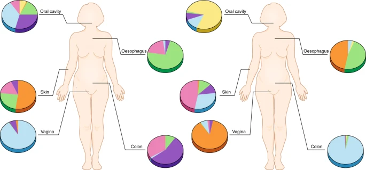

The human body is home to trillions of bacteria, archaea, viruses, and fungi — collectively called the **microbiome**. These communities play roles in immune development, metabolism, and susceptibility to disease. Understanding which microbes are present, in what proportions, and how those communities differ across individuals or conditions is now a central question across many areas of biomedical research.

## What is the microbiome?

The term microbiome refers to the complete collection of microorganisms inhabiting a particular environment — and in humans, that environment can be the gut, skin, oral cavity, lung, vaginal tract, or any number of other niches. Each body site harbors a distinct community shaped by the local environment: temperature, pH, oxygen availability, and available nutrients.

The gut microbiome is the most studied. A healthy adult gut hosts hundreds to thousands of bacterial species, with the dominant phyla being *Firmicutes* and *Bacteroidetes*, followed by *Proteobacteria*, *Actinobacteria*, and *Verrucomicrobia*. But these proportions are not fixed — they vary substantially from person to person and within the same person over time.

{fig-align="center" width="65%"}

## Variability: across people and over time

One of the most striking features of the human microbiome is how variable it is.

**Between individuals** — two healthy adults can have dramatically different gut microbiomes. Factors that drive inter-individual variation include diet (especially fiber intake), genetics, geography, early-life exposures (delivery mode, breastfeeding), and medications — particularly antibiotics. This variability means that a "normal" microbiome is difficult to define, and that detecting a disease-associated signal requires careful control for these sources of variation.

**Within an individual over time** — the microbiome of a single person is also dynamic. The gut microbiome shows day-to-day fluctuations driven by diet, travel, illness, and stress. Perturbations such as antibiotics can dramatically alter composition within days, with recovery taking weeks to months. Longitudinal studies that measure the same individuals at multiple time points capture this within-person variability, which is often as large as the differences between individuals.

This variability is not noise to be eliminated — it is signal. Understanding what drives it is the central scientific question of the field.

## 16S rRNA sequencing: a culture-independent approach

One primary tool for profiling bacterial communities is **16S rRNA gene sequencing**. The 16S rRNA gene is present in all bacteria and archaea. Within this gene — approximately 1,500 base pairs long — some regions are highly conserved across species (useful for designing universal primers), while others are variable enough to distinguish taxonomic units. By amplifying and sequencing these variable regions, researchers can profile bacterial communities directly from a biological sample, without needing to grow any organisms in culture.

{fig-alt="16S gene visualization" fig-align="center"}

This workshop walks through a typical analysis pipeline for 16S rRNA sequencing from sample collection through diversity analysis. The emphasis is on understanding *why* each step exists, what decisions you are making along the way, and how those decisions shape other choices and results downstream.

| Stage | What happens |
|------------------------------------|------------------------------------|
| **Introduction** | |
| [What is 16S rRNA seq?](16s-overview.qmd) | The 16S gene, variable regions, and amplicons |
| **Preprocessing** | |
| [Sequencing & Confounders](03-sequencing.qmd) | How reads are generated and technical variation |
| [Amplification & Pooling](02-amplification.qmd) | PCR to enrich the 16S rRNA gene |
| [FASTQ Files](04-fastq.qmd) | Raw data files from the sequencer |
| [QC Reports](qc-reports.qmd) | Inspecting data quality before analysis |
| [Trimming & Truncation](trimming.qmd) | Removing primers and low-quality bases |
| [Denoising & Merging](denoising.qmd) | Building the ASV count table |
| [Normalization](normalization.qmd) | Accounting for sequencing depth differences |
| **Downstream Analysis** | |
| [Taxonomy Assignment](taxonomy.qmd) | Naming ASVs and visualizing community structure |
| [Guilds](guilds.qmd) | Ecologically relevant groupings |
| [Diversity Analysis](09-diversity-analysis.qmd) | Alpha and beta diversity, statistical testing |
| [Differential Abundance](diff-abundance.qmd) | Identifying taxa that differ between groups |

## How to read this guide

Each page uses four types of callout boxes to signal different kinds of content. Click any box below to see an example.

::: {.callout-note collapse="true"}
## Further information

These boxes provide additional context, background, or elaboration that deepens understanding without being required reading. They typically explain *why* something works the way it does, or offer an analogy to make an abstract concept more concrete.

**Example of when you'll see this:** An explanation of why quality scores degrade toward the 3′ end of a read, or what a rarefaction curve is measuring conceptually.
:::

::: {.callout-warning collapse="true"}
## Warnings

These boxes flag common mistakes, easy-to-overlook pitfalls, or steps where errors are frequently introduced. Pay close attention — skipping or mis-applying the flagged step often causes silent failures that are difficult to diagnose later.

**Example of when you'll see this:** Reminders to use Qubit instead of NanoDrop for quantification, or that primer trimming cannot be skipped before DADA2.
:::

::: {.callout-important collapse="true"}
## Reproducibility reminders

These boxes highlight decisions that must be documented for reproducibility of your analysis. The items that these point out should always be included in your documentation to ensure that you (and others) can replicate your analysis.

**Example of when you'll see this:** The requirement that truncation parameters, extraction kits, and rarefaction depth be identical across all samples in a study.
:::

::: {.callout-tip collapse="true"}
## Code and tool examples

These expandable blocks contain example code from different tools to illustrate how a pipeline step is implemented in practice. They are collapsed by default, but you can open them if you want to see more about the mechanics behind a step.

``` bash
# Example: primer trimming with Cutadapt
cutadapt \
  -g GTGYCAGCMGCCGCGGTAA \
  -G GGACTACNVGGGTWTCTAAT \
  --discard-untrimmed \
  -o sample_R1_trimmed.fastq.gz \
  -p sample_R2_trimmed.fastq.gz \
  sample_R1.fastq.gz sample_R2.fastq.gz
```
:::