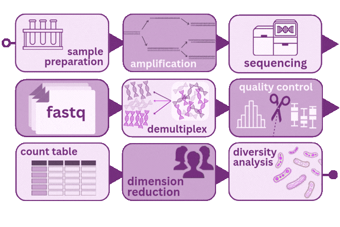

The human body is home to trillions of microorganisms — bacteria, archaea, viruses, and fungi — collectively called the microbiome. These communities play documented roles in immune development, metabolism, and susceptibility to disease. Understanding which microbes are present, in what proportions, and how those communities differ across individuals or conditions is now a central question across many areas of biomedical research.

The primary tool for profiling bacterial communities is **16S rRNA gene sequencing**. The 16S rRNA gene is present in all bacteria and archaea. Within its \~1,500 base pairs, some regions are highly conserved across species — useful for designing universal primers — while others are variable enough to act as genetic barcodes that distinguish taxa. By amplifying and sequencing these variable regions, researchers can profile entire bacterial communities directly from a biological sample, without culturing a single organism.

This workshop walks through the full analysis pipeline, from sample collection through diversity analysis. The emphasis is on understanding *why* each step exists, what decisions you are making along the way, and how those decisions shape the biology you can — and cannot — see in your results.

This is not a coding tutorial. The goal is enough conceptual grounding to collaborate effectively with a bioinformatician, critically evaluate published microbiome analyses, and make informed decisions when you design your own studies.

## The pipeline at a glance

{fig-align="center" width="65%"}

| Stage | What happens |
|------------------------------------|------------------------------------|
| [Sample preparation](01-sample-prep.qmd) | DNA extraction from your biological material |
| [Amplification](02-amplification.qmd) | PCR to enrich the 16S rRNA gene |
| [Sequencing](03-sequencing.qmd) | Short-read sequencing of the amplicons |
| [FASTQ files](04-fastq.qmd) | Raw data files from the sequencer |
| [Demultiplexing](05-demultiplexing.qmd) | Sorting reads back to individual samples |
| [Quality control](06-quality-control.qmd) | Filtering and trimming low-quality reads |
| [Count table](07-count-table.qmd) | Building a table of taxa × samples |
| [Normalization & ordination](08-dimension-reduction.qmd) | Accounting for sequencing depth differences |
| [Diversity analysis](09-diversity-analysis.qmd) | Alpha and beta diversity, statistical testing |

## A note on reproducibility

Every decision you make in this pipeline — extraction kit, primer pair, quality threshold, rarefaction depth — affects your results. Reporting those decisions completely is as important as the biology itself. If a collaborator cannot reproduce your count table from your raw reads, the analysis cannot be independently verified.

Use this site alongside your own notes to build a record of the choices made in your study.