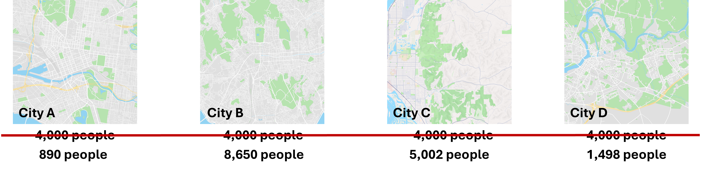
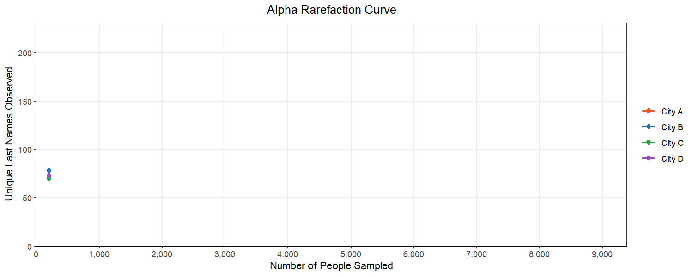
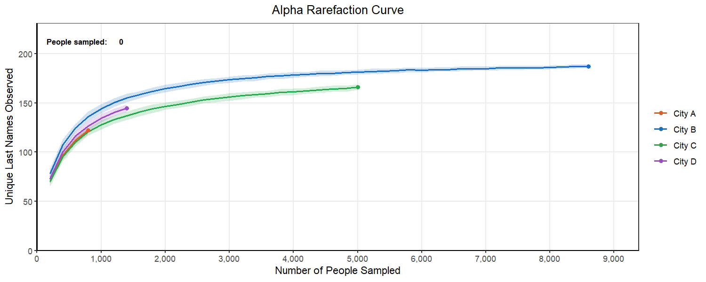

The count table contains raw read counts, but those counts are not directly comparable across samples. Different samples received different numbers of sequencing reads: some may have 50,000, others 8,000. This technical variation is not related to the biological question that we are interested in considering in downstream analyses. Before comparing community composition across samples, you need to account for these differences to ensure any findings from later are not driven by this difference in sequencing depth.

## Why sequencing depth varies

Even when you carefully normalize the pooled library before loading the sequencer, different samples end up with different read counts. This can arise from a variety of different things:

-   Slight differences in DNA concentration across samples before pooling
-   Amplification efficiency differences (biological and technical)
-   Random sampling variation in cluster formation on the flow cell

The result is that a taxon observed in 100 reads in a sample with 10,000 total reads (1%) looks very different from the same taxon in 500 reads in a sample with 50,000 reads (also 1%), even though the relative abundance is identical. Along with this, samples with a much deeper sequencing depth are likely to find more unique amplicon sequencing variants. How can we compare across samples?

Let's talk about some potential options for this issue.

## Rarefaction

One approach to resolve this problem is to rarefy, or subsample, all samples down to the same read depth. Sometimes this is the depth of the shallowest sample, or a chosen cutoff that retains most samples.

-   **Pro**: simple to understand; many diversity metrics were developed with this approach in mind
-   **Con**: discards real data from well-sequenced samples; samples with fewer reads than the cutoff are excluded entirely; results depend on the randomly chosen cutoff

::: callout-caution
## Choosing a rarefaction depth

This decision is often agonized over. There is no objectively correct rarefaction depth. Some researchers run the analysis at multiple depths to check whether conclusions are sensitive to the choice. Doing this iteratively at multiple depths can produce an **alpha rarefaction curve**, which is discussed below.

Ultimately, the most important aspect of this process is clearly documenting the choice of rarefaction depth and any samples which are removed from the analysis in the process.
:::

### Alpha rarefaction curves

Before choosing a rarefaction depth, examine how diversity changes as a function of sequencing depth for each sample. An **alpha rarefaction curve** plots observed features (ASVs) on the y-axis against sequencing depth on the x-axis, starting from a small subsample and increasing to the full read count.

At low depths, each additional read tends to reveal new taxa. As depth increases, the curve flattens, and you are reading more sequences but finding fewer new organisms. This plateau indicates that most of the detectable diversity in that sample has been captured.

How to use this to choose a rarefaction depth:

-   Choose a depth where most samples' curves have plateaued. Sequencing deeper beyond this point yields diminishing returns.
-   The depth must also be low enough to retain a sufficient number of samples. Any sample with fewer reads than the cutoff is excluded from subsequent analysis.
-   The goal is to maximize both completeness (plateau reached) and sample retention (enough samples kept).

::: {.callout-note .city-analogy}
## Rarefaction in the census

Let's jump back into the city to get a better intuition behind this process.

Let's say we are looking at four different cities. We are doing a survey where we are randomly sampling from each of the cities to collect last names and get an idea of the population.

{fig-align="center" style="background-color:white;"}

We can see here our four cities. Ideally, we would randomly reach out to the same number of people. For example, we might survey 4,000 people and compare the composition of last names between the cities.

Unfortunately, as we have discussed previously, the multiplexing of samples when sequencing does not result in the same sequencing depth for all samples; in fact, there is often a meaningful difference. So it would be more like we see above, where there is a large range of the number of people we sample from each city.

Now, if we have 18 Smiths in city A and 92 Smiths in City C, how are we supposed to meaningfully compare whether there are more Smiths in one city versus the other when the overall number of people sampled is not the same?

If we use rarefaction, we are going to subsample from each city the same number of people, allowing us to compare the counts we have. However, how do we know we have sampled enough people that we are preserving the composition of those cities? Is 890 people from each city enough? Or do we need to consider sampling 1,400 people?

{fig-align="center"}

We can start to consider this problem by looking at an alpha rarefaction curve like the one above. We will randomly subsample many times at each sampling depth and each time count the number of unique last names in that subsample. We want to select a subsampling depth that is no longer consistently returning more unique last names as we go above it. This looks like a place in the curve where there is flattening of most of our lines.

Below, we can see what happens as we select different subsampling depths. You will notice that to pick a point where most of the cities curves flatten out, we have to pick a number for the subsample that exceeds the original sample from City A. This would mean that we would have to drop City A from our analysis. This is a common balancing act in rarefaction, where you want to retain as many replicates as you can while also ensuring your are sampling enough to represent the true population in the sample.

{fig-align="center"}
:::

::: {.callout-note collapse="true"}
## More on rarefaction, normalization, and the other joys of microbiome data statistical complexity

For more on the impact of each of these methods for dealing with unequal sequencing depth:

-   Weiss, S., Xu, Z.Z., Peddada, S. *et al.* Normalization and microbial differential abundance strategies depend upon data characteristics. *Microbiome* **5**, 27 (2017). https://doi.org/10.1186/s40168-017-0237-y

-   McMurdie, P. J., & Holmes, S. (2014). Waste not, want not: why rarefying microbiome data is inadmissible. *PLoS computational biology*, *10*(4), e1003531. https://doi.org/10.1371/journal.pcbi.1003531

-   Willis A. D. (2019). Rarefaction, Alpha Diversity, and Statistics. *Frontiers in microbiology*, *10*, 2407. https://doi.org/10.3389/fmicb.2019.02407

More on the general statistical complexity of 16S rRNA sequencing data:

-   Gloor, G. B., Macklaim, J. M., Pawlowsky-Glahn, V., & Egozcue, J. J. (2017). Microbiome Datasets Are Compositional: And This Is Not Optional. *Frontiers in microbiology*, *8*, 2224. https://doi.org/10.3389/fmicb.2017.02224

-   Kaul, A., Mandal, S., Davidov, O., & Peddada, S. D. (2017). Analysis of Microbiome Data in the Presence of Excess Zeros. *Frontiers in microbiology*, *8*, 2114. https://doi.org/10.3389/fmicb.2017.02114
:::

::: {.callout-tip collapse="true"}
## Code and tool examples

**R**

For more information about using phyloseq for rarefaction in R, look here: [phyloseq documentation](https://joey711.github.io/phyloseq/)

``` r
library(phyloseq)
library(vegan)

# Generate alpha rarefaction curves to help choose a rarefaction depth
otu_mat <- as(otu_table(physeq), "matrix")
if (taxa_are_rows(physeq)) otu_mat <- t(otu_mat)
rarecurve(otu_mat, step = 500, label = FALSE, main = "Alpha Rarefaction Curves")

# Rarefy to a chosen depth (set seed for reproducibility)
# Samples with fewer reads than sample.size are dropped
physeq_rare <- rarefy_even_depth(physeq, sample.size = 10000, rngseed = 42)
```

**QIIME2**

For more information about rarefaction in QIIME2, look here: [alpha-rarefaction documentation](https://docs.qiime2.org/2024.10/plugins/available/diversity/alpha-rarefaction/) and [rarefy documentation](https://docs.qiime2.org/2024.10/plugins/available/feature-table/rarefy/)

``` bash
# Generate alpha rarefaction curves to help choose a sampling depth
# Set --p-max-depth to the maximum depth you want to explore
qiime diversity alpha-rarefaction \
  --i-table table.qza \
  --i-phylogeny rooted-tree.qza \
  --p-max-depth 10000 \
  --m-metadata-file metadata.tsv \
  --o-visualization alpha-rarefaction.qzv

# Rarefy the feature table to the chosen sampling depth
# Samples below the chosen depth will be dropped from the rarefied table
qiime feature-table rarefy \
  --i-table table.qza \
  --p-sampling-depth 10000 \
  --o-rarefied-table rarefied-table.qza
```
:::
